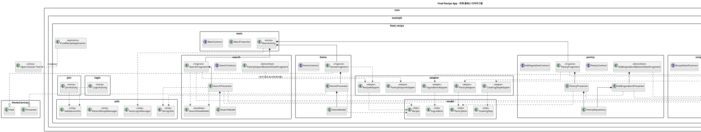

# Class Diagram

```plantuml
@startuml
title Food Recipe App - 전체 클래스 다이어그램

skinparam linetype ortho
skinparam packageStyle rectangle

package "com.example.food_recipe" {

    package "main" {
        class MainActivity <<Activity>>
        class MainPresenter
        interface MainContract
    }

    package "home" {
        class HomeFragment <<Fragment>>
        class HomePresenter
        interface HomeContract
        class HomeModel
    }

    package "search" {
        class SearchFragment <<Fragment>>
        class SearchPresenter
        class SearchViewModel <<ViewModel>>
        interface SearchContract
        class SearchModel
        class PantryImportBottomSheetFragment <<BottomSheet>>
    }

    package "pantry" {
        class PantryFragment <<Fragment>>
        class PantryPresenter
        interface PantryContract
        class PantryRepository
        class AddIngredientBottomSheetFragment <<BottomSheet>>
        class AddIngredientPresenter
        interface AddIngredientContract
    }

    package "recipedetail" {
        class RecipeDetailFragment <<Fragment>>
        class RecipeDetailPresenter
        interface RecipeDetailContract
        class RecipeDetailModel
    }

    package "adapter" {
        class RecipeAdapter <<Adapter>>
        class PantryAdapter <<Adapter>>
        class PantryImportAdapter <<Adapter>>
        class IngredientAdapter <<Adapter>>
        class CookingStepAdapter <<Adapter>>
    }

    package "model" {
        class Recipe <<POJO>>
        class PantryItem <<POJO>>
        class Ingredient <<POJO>>
        class CookingStep <<POJO>>
    }

    package "utils" {
        class StringUtils <<Utility>>
        class ValidationUtils <<Utility>>
        class RecentRecipeManager <<Utility>>
        class AutoLoginManager <<Utility>>
    }

    package "login" {
        class LoginActivity <<Activity>>
    }
    package "join" {
        class JoinActivity <<Activity>>
    }

    class FoodRecipeApplication <<Application>>
}

' --- 외부 라이브러리 ---
class "Open Korean Text" as OKT <<Library>>


' --- 관계 정의 (Relationships) ---

' MainActivity holds Fragments
MainActivity *-- HomeFragment
MainActivity *-- SearchFragment
MainActivity *-- PantryFragment

' MVP/MVVM Relationships within each package
HomeFragment ..|> HomeContract.View
HomePresenter ..|> HomeContract.Presenter
HomeFragment *-- HomePresenter
HomePresenter *-- HomeModel

SearchFragment ..|> SearchContract.View
SearchPresenter ..|> SearchContract.Presenter
SearchFragment *-- SearchPresenter
SearchPresenter *-- SearchModel
SearchFragment ..> SearchViewModel
SearchPresenter ..> SearchViewModel

PantryFragment ..|> PantryContract.View
PantryPresenter ..|> PantryContract.Presenter
PantryFragment *-- PantryPresenter
PantryPresenter *-- PantryRepository

AddIngredientBottomSheetFragment ..|> AddIngredientContract.View
AddIngredientPresenter ..|> AddIngredientContract.Presenter
AddIngredientBottomSheetFragment *-- AddIngredientPresenter
AddIngredientPresenter *-- PantryRepository

RecipeDetailFragment ..|> RecipeDetailContract.View
RecipeDetailPresenter ..|> RecipeDetailContract.Presenter
RecipeDetailFragment *-- RecipeDetailPresenter
RecipeDetailPresenter *-- RecipeDetailModel

' Adapter Relationships
HomeFragment ..> RecipeAdapter
PantryFragment ..> PantryAdapter
SearchFragment ..> RecipeAdapter : "(검색 결과 표시에 재사용)"
PantryImportBottomSheetFragment ..> PantryImportAdapter
RecipeDetailFragment ..> IngredientAdapter
RecipeDetailFragment ..> CookingStepAdapter

' Model Usage
RecipeAdapter ..> Recipe
PantryAdapter ..> PantryItem
IngredientAdapter ..> Ingredient
CookingStepAdapter ..> CookingStep
HomePresenter ..> Recipe
SearchPresenter ..> Recipe
PantryPresenter ..> PantryItem

' Utils Usage
SearchPresenter ..> StringUtils
AddIngredientPresenter ..> StringUtils
JoinActivity ..> ValidationUtils
LoginActivity ..> ValidationUtils
MainActivity ..> AutoLoginManager

' Application Level
FoodRecipeApplication ..> OKT : initializes

@enduml
```
