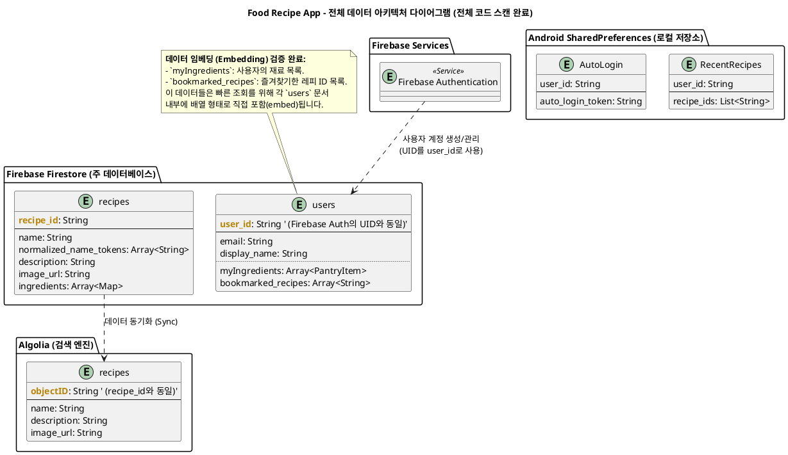

# ERD (Entity-Relationship Diagram)

```plantuml
@startuml
title Food Recipe App - 전체 데이터 아키텍처 다이어그램 (전체 코드 스캔 완료)

!define primary_key(x) <b><color:#b8860b>x</color></b>
!define foreign_key(x) <color:#aaaaaa>x</color>

package "Firebase Services" {
    ' [오류 수정] component 대신 entity <<Service>>를 사용하여 ERD 문법의 일관성을 유지합니다.
    entity "Firebase Authentication" as FirebaseAuth <<Service>>
}

package "Firebase Firestore (주 데이터베이스)" {
    entity "users" as user {
        primary_key(user_id): String ' (Firebase Auth의 UID와 동일)'
        --
        email: String
        display_name: String
        ..
        '**[Embedded Data]**'
        myIngredients: Array<PantryItem>
        bookmarked_recipes: Array<String>
    }

    entity "recipes" as recipe {
        primary_key(recipe_id): String
        --
        name: String
        normalized_name_tokens: Array<String>
        description: String
        image_url: String
        ingredients: Array<Map>
    }
}

package "Algolia (검색 엔진)" {
    entity "recipes" as algolia_recipe {
        primary_key(objectID): String ' (recipe_id와 동일)'
        --
        name: String
        description: String
        image_url: String
    }
}

package "Android SharedPreferences (로컬 저장소)" {
    entity "RecentRecipes" as recent {
        user_id: String
        --
        recipe_ids: List<String>
    }
    entity "AutoLogin" as autologin {
        user_id: String
        --
        auto_login_token: String
    }
}


' --- 관계 ---
FirebaseAuth ..> user : "사용자 계정 생성/관리\n(UID를 user_id로 사용)"
recipe ..> algolia_recipe : "데이터 동기화 (Sync)"


note top of user
  **데이터 임베딩 (Embedding) 검증 완료:**
  - `myIngredients`: 사용자의 재료 목록.
  - `bookmarked_recipes`: 즐겨찾기한 레피 ID 목록.
  이 데이터들은 빠른 조회를 위해 각 `users` 문서
  내부에 배열 형태로 직접 포함(embed)됩니다.
end note

@enduml
```
