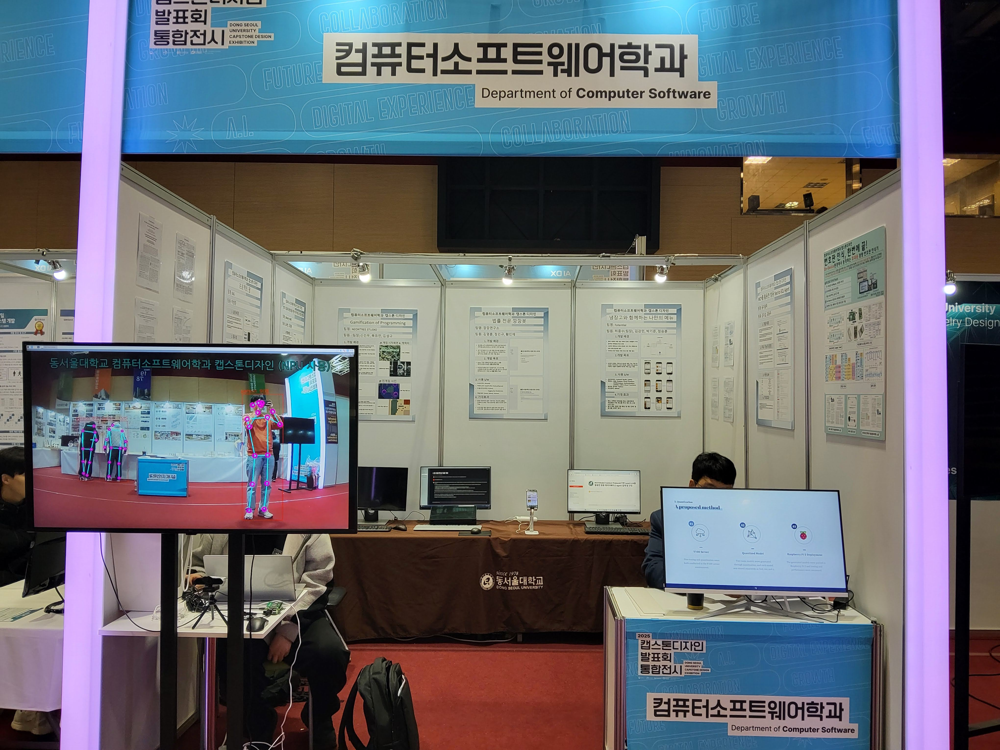
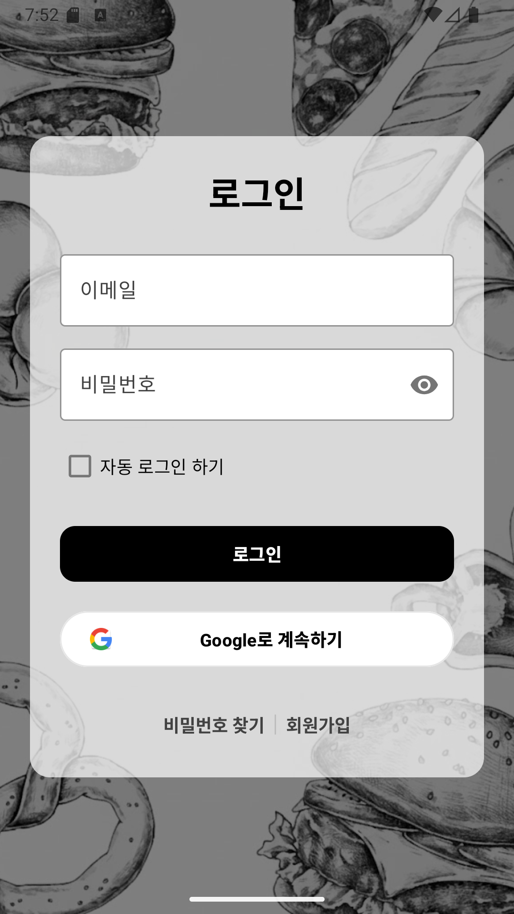
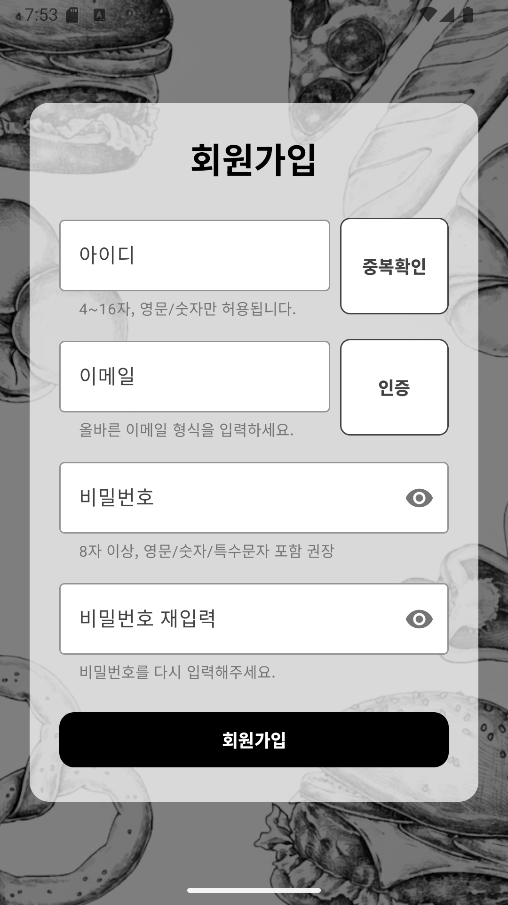
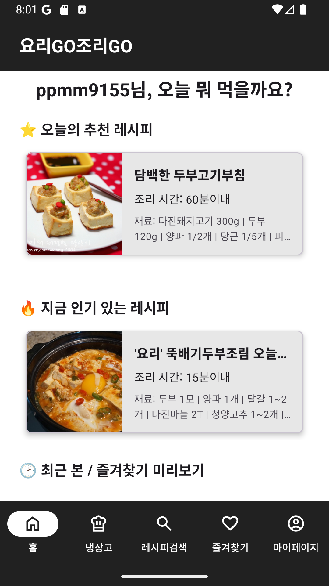
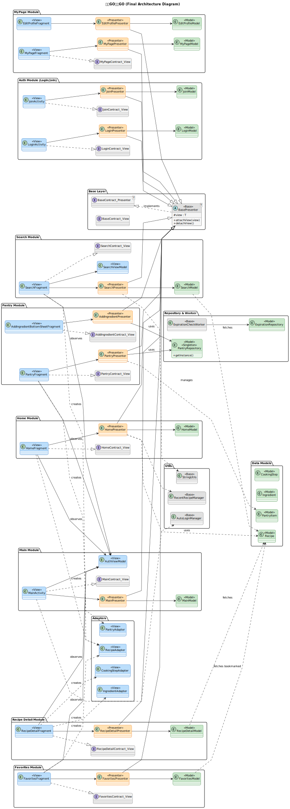

<div align=center style="margin-bottom:30px">
  
</div>

# 요리GO조리GO

<br>

> 냉장고 속 잠자고 있는 재료들을 깨워줄 똑똑한 식재료 관리 및 레시피 추천 앱입니다.
> Firebase와 Algolia를 연동하여 실시간 데이터 동기화와 강력한 검색 기능을 구현한 안드로이드 네이티브 앱입니다.

<br>

## 캡스톤 디자인 전시회

<div align=center>
  
</div>

<br>

## 👑 주요 기능

* **회원 시스템:** Firebase Authentication을 이용한 이메일/비밀번호 및 Google 소셜 로그인/회원가입 기능을 제공합니다.
* **나만의 냉장고:** 사용자가 보유한 식재료를 냉장/냉동/실온으로 구분하여 등록하고 유통기한을 관리할 수 있습니다.
* **유통기한 알림:** Android WorkManager를 활용하여, 유통기한이 임박한 재료가 있을 시 백그라운드에서 푸시 알림을 전송합니다.
* **레시피 추천:** 홈 화면에서 인기 레시피, 최근 본 레시피, 즐겨찾기한 레시피 등 맞춤형 목록을 제공합니다.
* **강력한 레시피 검색:**
    * **Algolia** 검색 엔진을 연동하여 10만 개의 레시피 중 빠르고 정확한 검색(오타 수정, 하이라이팅)을 지원합니다.
    * '내 냉장고 재료로 검색하기' 기능을 통해 현재 보유한 재료를 조합하여 만들 수 있는 레시피를 검색합니다.
* **즐겨찾기:** 마음에 드는 레시피를 저장하고 '즐겨찾기' 탭에서 모아볼 수 있습니다.
* **백엔드 로직:** Firebase Functions (TypeScript)를 사용하여 Firestore의 데이터 변경(추천 수, 재료)을 감지하고 Algolia 인덱스 동기화, 유통기한 알림 관리 등 서버 측 로직을 자동 수행합니다.

<br>

## 📱 App 미리보기

<table>
  <tr>
    <td align="center"><br><b>로그인</b></td>
    <td align="center"><br><b>회원가입</b></td>
  </tr>
  <tr>
    <td align="center"><br><b>홈 화면</b></td>
    <td align="center"><br><b>레시피 검색</b></td>
  </tr>
  <tr>
    <td align="center"><br><b>나만의 냉장고</b></td>
    <td align="center"><br><b>레시피 상세 정보</b></td>
  </tr>
</table>

<br>

## 📌 프로젝트 정보

* **프로젝트:** 졸업작품 및 캡스톤 디자인
* **주제:** 식재료 관리 및 레시피 추천 안드로이드 앱
* **팀원:** [하종수](https://github.com/sanddunn)(팀장), [박기준](https://github.com/ppmm9155), 정승훈, 김강민
* **개발 기간:** 2025.03. ~ 2025.06., 2025.08. ~ 2025.11.
* **주요 목표:**
    1.  Firebase (Auth, Firestore, Functions)와 Algolia 검색 엔진을 연동한 네이티브 안드로이드 앱 개발.
    2.  MVP (Model-View-Presenter) 아키텍처 패턴을 적용하여 비즈니스 로직과 UI 분리.
    3.  WorkManager, Navigation Component 등 최신 AndroidX 라이브러리 활용.

<br>

## 📑 프로젝트 문서 (Project Documents)

### 3학년 1학기 (기획 및 설계)
* **[요구사항 분석서 (PDF)](documents/3rd_Year_1st_Semester/01_SE_Requirements_Analysis.pdf):** 사용자 요구사항 정의 및 유스케이스 명세
* **[프로젝트 계획서 (PDF)](documents/3rd_Year_1st_Semester/02_SE_Project_Plan.pdf):** WBS, 일정 계획 및 개발 방법론(Agile) 정의
* **[테스트 계획서 (PDF)](documents/3rd_Year_1st_Semester/03_SE_Test_Plan.pdf):** 테스트 시나리오, 품질 목표 및 리스크 관리 전략
* **[졸업작품 종합설계 계획서 (PDF)](documents/3rd_Year_1st_Semester/04_Graduation_Design_Plan.pdf):** 초기 아키텍처 설계

<br>

## 📊 데이터 출처

* **KADX농식품 빅데이터 거래소:** [무료 레시피 데이터 (만개의 레시피)](https://kadx.co.kr/opmk/frn/pmumkproductDetail/PMU_79c6f1a4-56dd-492e-ad67-c5acba0304d2/5)를 기반으로 사용했습니다.
* **웹 크롤링:** `data_pipeline` 패키지의 Python 스크립트를 통해 **만개의 레시피** 웹 사이트에서 부족한 데이터를 추가적으로 수집하고 정제하여 데이터베이스를 구축했습니다.

<br>

## 🍉 기술 스택

### 📱 App (Android)


### ☁️ Backend & Database


<br>

## 🛠 개발 환경 (Prerequisites)

이 프로젝트를 실행하기 위해 필요한 최소 환경입니다.

* **IDE:** Android Studio Narwhal | 2025.1.3 (Build #AI-251.26094.121)
* **JDK:** Java 17 이상 (Gradle 8.13 호환, JetBrains Runtime 21.0.7 사용)
* **Android SDK:**
    * `minSdk`: 26 (Android 8.0 Oreo)
    * `targetSdk`: 36 (Android 16)
    * `compileSdk`: 36
* **Build System:** Gradle 8.13

<br>

## ⚙️ 설치 방법

1.  **Firebase 프로젝트 설정**
    *   Firebase Console에서 새 프로젝트를 생성하고 Android 앱을 등록합니다.
    *   **(필수) SHA-1 인증서 지문 등록:** Google 로그인을 위해 **디버그(Debug) 및 릴리즈(Release) SHA-1 지문**을 Firebase 프로젝트 설정에 추가해야 합니다.
    *   **(필수)** 프로젝트 설정에서 `google-services.json` 파일을 다운로드하여 `app/` 디렉토리에 추가해야 합니다. 이 파일은 앱이 Firebase 서비스에 연결하는 데 필요합니다.
    *   Authentication (이메일/비밀번호, Google 로그인), Firestore, Functions를 활성화합니다.

2.  **Algolia API 키 설정**
    *   Algolia에서 새 애플리케이션을 생성합니다.
    *   **(필수)** 프로젝트 루트의 `local.properties` 파일에 아래 내용을 추가하고, 자신의 Algolia 키로 교체해야 합니다.
        ```properties
        ALGOLIA_APP_ID="YOUR_ALGOLIA_APP_ID"
        ALGOLIA_API_KEY="YOUR_ALGOLIA_SEARCH_API_KEY"
        ```
    *   `ALGOLIA_API_KEY`에는 Algolia 대시보드의 API Keys 메뉴에서 **Search-Only API Key**를 사용하세요.

3.  **Android 앱 빌드**
    *   Android Studio에서 프로젝트를 엽니다.
    *   Gradle 동기화 후 앱을 빌드합니다.

<br>

## 🚀 시작 가이드

1.  **Firebase Functions 배포**
    *   `functions` 디렉토리에서 `npm install`을 실행하여 모든 종속성을 설치합니다.
    *   **(필수) Functions 환경 변수 설정:** `.env.example` 파일을 참고하여 `.env.<YOUR_PROJECT_ID>` 파일을 생성하고 Algolia **Admin API Key**를 설정합니다. (Functions는 이 Admin Key로 Firestore 변경 사항을 Algolia에 반영합니다.)
    *   `firebase deploy --only functions` 명령어로 함수를 배포합니다.

2.  **데이터 파이프라인 실행 (최초 1회)**
    *   `data_pipeline` 디렉토리의 Python 스크립트를 실행하여 레시피 데이터를 Firestore에 색인합니다.
    *   **Algolia 연동:** 이 프로젝트는 **커스텀 Functions**를 사용하여 Firestore의 `recommend_count` 변경을 Algolia에 실시간 동기화합니다.
    *   최초 대량 색인을 위해서는 Firebase Extensions을 사용하거나 별도의 스크립트를 사용해야 합니다. Extensions를 사용한다면:
    *   **Algolia 인덱스 설정:** 인덱스 이름은 `recipes`이며, 검색(Search)에 사용되는 주요 필드는 `title`,`ingredients`,`cooking_time`,`imageUrl`,`view_count`,`scrap_count`,`recommend_count` Alternative Object Id는 `RCP_SNO` 입니다.

3.  **앱 실행**
    *   Android Studio에서 앱을 실행하여 회원가입 후 기능을 테스트합니다.

<br>

## 🎀 아키텍처

본 프로젝트는 **MVP (Model-View-Presenter) 아키텍처**를 기반으로 설계되었습니다. 이 구조는 비즈니스 로직과 UI를 명확히 분리하여 코드의 유지보수성과 테스트 용이성을 높입니다.

*   **Model:** 데이터 처리를 담당하며, `repository` 패키지가 이 역할을 수행합니다. Firebase Firestore와의 통신을 통해 데이터를 가져오거나 저장합니다.
*   **View:** 사용자 인터페이스(UI)를 담당하며, Activity와 Fragment가 여기에 해당됩니다. 사용자의 입력을 Presenter에게 전달하고, Presenter가 전달하는 데이터를 화면에 표시합니다.
*   **Presenter:** View와 Model 사이의 중재자 역할을 합니다. View로부터 받은 사용자 입력을 해석하고, 필요한 데이터를 Model에 요청합니다. Model로부터 받은 데이터를 가공하여 View가 화면에 표시할 수 있도록 전달합니다.

### 시스템 아키텍처
<details>
<summary><b>시스템 아키텍처 보기/숨기기</b></summary>
<br>

</details>

### 클래스 다이어그램
<details>
<summary><b>클래스 다이어그램 보기/숨기기</b></summary>
<br>

</details>

---

## 📊 데이터 아키텍처 (ERD)

본 프로젝트의 데이터는 **Firebase Firestore**를 메인 데이터베이스로 사용하며, 빠른 검색을 위해 **Algolia**와 데이터를 동기화합니다. 이 과정의 핵심 로직은 **Firebase Cloud Functions**가 담당하는 서버리스 아키텍처를 기반으로 합니다.

*   **Firebase Firestore:** `users`와 `recipes`라는 두 개의 메인 컬렉션으로 구성됩니다. 사용자 정보와 10만 개의 레시피 원본 데이터가 저장되어 앱의 기본적인 데이터 소스 역할을 합니다.
*   **Algolia:** 검색에 필요한 최소한의 레시피 데이터(`name`, `description` 등)만을 저장하여, 사용자가 입력한 검색어에 대해 빠르고 정확한 결과를 반환하는 데 집중합니다.
*   **Firebase Cloud Functions:** Firestore의 데이터 변경을 감지하여 서버 측 로직을 자동 수행합니다.
    *   **실시간 동기화:** `recipes` 컬렉션의 추천 수가 변경되면, Functions가 이를 감지하여 Algolia 인덱스를 즉시 업데이트합니다.
    *   **유통기한 알림 관리:** 사용자가 '나만의 냉장고' 재료를 수정하면, Functions가 유통기한 관련 데이터를 별도 컬렉션으로 동기화하여 WorkManager가 알림을 보낼 수 있도록 준비합니다.

### ERD 다이어그램
<details>
<summary><b>ERD 다이어그램 보기/숨기기</b></summary>
<br>

</details>

---

## 🗃️ 파일 구조

```
.
├── app/                  # 안드로이드 앱 모듈
│   ├── src/main/
│   │   ├── java/com/example/food_recipe/
│   │   │   ├── FoodRecipeApplication.java  # Application 클래스 (앱 초기화)
│   │   │   ├── adapter/          # RecyclerView 어댑터
│   │   │   ├── base/             # MVP 패턴의 Base 클래스 (BaseContract, BasePresenter)
│   │   │   ├── model/            # 데이터 모델 클래스 (Recipe, User 등)
│   │   │   ├── repository/       # 데이터 처리 (Firestore 연동)
│   │   │   ├── utils/            # 유틸리티 클래스 (StringUtils, DateUtils 등)
│   │   │   ├── worker/           # WorkManager 관련 클래스
│   │   │   ├── login/            # 로그인
│   │   │   ├── join/             # 회원가입
│   │   │   ├── findps/           # 비밀번호 찾기
│   │   │   ├── main/             # 메인 화면 (Activity + 하위 Fragment)
│   │   │   ├── home/             # 홈 화면
│   │   │   ├── search/           # 레시피 검색
│   │   │   ├── pantry/           # 나만의 냉장고
│   │   │   ├── favorites/        # 즐겨찾기
│   │   │   ├── mypage/           # 마이페이지
│   │   │   ├── editprofile/      # 회원정보 수정
│   │   │   └── recipetail/     # 레시피 상세
│   │   ├── res/              # 리소스 (레이아웃, 이미지 등)
│   ├── build.gradle.kts    # 앱 모듈 빌드 스크립트
├── functions/              # Firebase Functions (TypeScript)
│   ├── src/
│   │   └── index.ts        # 백엔드 로직 (Algolia 동기화, 알림 등)
├── data_pipeline/          # 데이터 파이프라인 (Python)
│   └── ...                 # 데이터 수집, 정제, Firestore/Algolia 업로드 스크립트
└── Readme.md               # 프로젝트 설명서
```
